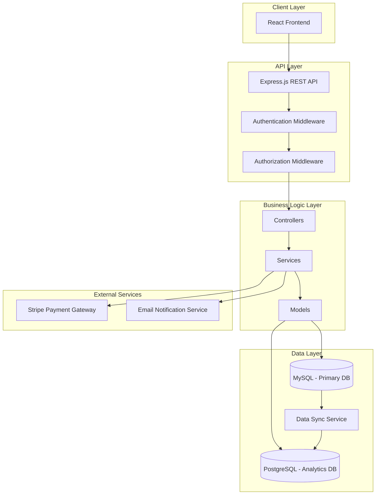
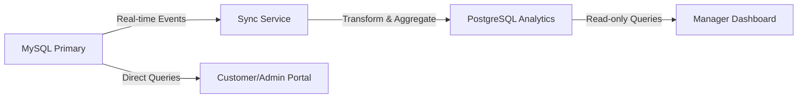

# WASCO Water Bill Management System - Technical Specification

## Project Overview
Distributed Online Water Bill Management Database Application for Water and Sewerage Company (WASCO) in Lesotho.

## Technology Stack

### Backend
- **Runtime**: Node.js (v18+)
- **Framework**: Express.js
- **Architecture**: MVC (Model-View-Controller)
- **Authentication**: JWT (JSON Web Tokens)
- **API Documentation**: Swagger/OpenAPI

### Frontend
- **Framework**: React.js (v18+)
- **State Management**: Redux Toolkit
- **UI Library**: Material-UI (MUI)
- **HTTP Client**: Axios
- **Charts**: Recharts/Chart.js

### Databases (Heterogeneous Distributed Setup)
- **Primary Database**: MySQL 8.0
  - Customer management
  - Billing operations
  - Water usage tracking
  - Real-time transactions
  
- **Analytics Database**: PostgreSQL 15
  - Historical data warehouse
  - OLAP operations
  - Reporting and analytics
  - Data aggregations

### Payment Gateway
- **Provider**: Stripe API
- **Features**: Secure payment processing, transaction logging, webhook handling

### Additional Tools
- **ORM**: Sequelize (MySQL) + Sequelize (PostgreSQL)
- **Validation**: Joi
- **Logging**: Winston
- **Testing**: Jest + Supertest
- **Environment**: dotenv

---

## System Architecture



---

## Database Schema Design

### MySQL Primary Database

#### 1. Users Table
```sql
CREATE TABLE users (
    user_id INT PRIMARY KEY AUTO_INCREMENT,
    username VARCHAR(50) UNIQUE NOT NULL,
    email VARCHAR(100) UNIQUE NOT NULL,
    password_hash VARCHAR(255) NOT NULL,
    role ENUM('customer', 'administrator', 'branch_manager') NOT NULL,
    is_active BOOLEAN DEFAULT TRUE,
    created_at TIMESTAMP DEFAULT CURRENT_TIMESTAMP,
    updated_at TIMESTAMP DEFAULT CURRENT_TIMESTAMP ON UPDATE CURRENT_TIMESTAMP,
    INDEX idx_email (email),
    INDEX idx_role (role)
);
```

#### 2. Districts Table
```sql
CREATE TABLE districts (
    district_id INT PRIMARY KEY AUTO_INCREMENT,
    district_name VARCHAR(100) NOT NULL,
    district_code VARCHAR(10) UNIQUE NOT NULL,
    region VARCHAR(50),
    created_at TIMESTAMP DEFAULT CURRENT_TIMESTAMP
);
```

#### 3. Customers Table
```sql
CREATE TABLE customers (
    customer_id INT PRIMARY KEY AUTO_INCREMENT,
    account_number VARCHAR(20) UNIQUE NOT NULL,
    user_id INT,
    first_name VARCHAR(50) NOT NULL,
    last_name VARCHAR(50) NOT NULL,
    id_number VARCHAR(20) UNIQUE,
    phone_number VARCHAR(20),
    email VARCHAR(100),
    physical_address TEXT,
    district_id INT,
    meter_number VARCHAR(20) UNIQUE,
    connection_type ENUM('residential', 'commercial', 'industrial') DEFAULT 'residential',
    connection_date DATE,
    is_active BOOLEAN DEFAULT TRUE,
    created_at TIMESTAMP DEFAULT CURRENT_TIMESTAMP,
    updated_at TIMESTAMP DEFAULT CURRENT_TIMESTAMP ON UPDATE CURRENT_TIMESTAMP,
    FOREIGN KEY (user_id) REFERENCES users(user_id) ON DELETE SET NULL,
    FOREIGN KEY (district_id) REFERENCES districts(district_id),
    INDEX idx_account_number (account_number),
    INDEX idx_district (district_id),
    INDEX idx_meter (meter_number)
);
```

#### 4. Billing Rates Table
```sql
CREATE TABLE billing_rates (
    rate_id INT PRIMARY KEY AUTO_INCREMENT,
    rate_tier VARCHAR(50) NOT NULL,
    connection_type ENUM('residential', 'commercial', 'industrial') NOT NULL,
    usage_range_min DECIMAL(10,2) NOT NULL,
    usage_range_max DECIMAL(10,2),
    cost_per_unit DECIMAL(10,2) NOT NULL,
    fixed_charge DECIMAL(10,2) DEFAULT 0.00,
    sewerage_charge_percentage DECIMAL(5,2) DEFAULT 0.00,
    effective_from DATE NOT NULL,
    effective_to DATE,
    is_active BOOLEAN DEFAULT TRUE,
    created_at TIMESTAMP DEFAULT CURRENT_TIMESTAMP,
    updated_at TIMESTAMP DEFAULT CURRENT_TIMESTAMP ON UPDATE CURRENT_TIMESTAMP,
    INDEX idx_connection_type (connection_type),
    INDEX idx_effective_dates (effective_from, effective_to)
);
```

#### 5. Water Usage Table
```sql
CREATE TABLE water_usage (
    usage_id INT PRIMARY KEY AUTO_INCREMENT,
    account_number VARCHAR(20) NOT NULL,
    reading_date DATE NOT NULL,
    meter_reading DECIMAL(10,2) NOT NULL,
    previous_reading DECIMAL(10,2) DEFAULT 0.00,
    consumption DECIMAL(10,2) GENERATED ALWAYS AS (meter_reading - previous_reading) STORED,
    reading_month INT NOT NULL,
    reading_year INT NOT NULL,
    meter_reader_id INT,
    reading_status ENUM('pending', 'verified', 'estimated') DEFAULT 'pending',
    notes TEXT,
    created_at TIMESTAMP DEFAULT CURRENT_TIMESTAMP,
    updated_at TIMESTAMP DEFAULT CURRENT_TIMESTAMP ON UPDATE CURRENT_TIMESTAMP,
    FOREIGN KEY (account_number) REFERENCES customers(account_number) ON DELETE CASCADE,
    FOREIGN KEY (meter_reader_id) REFERENCES users(user_id),
    UNIQUE KEY unique_reading (account_number, reading_month, reading_year),
    INDEX idx_reading_date (reading_date),
    INDEX idx_account_month (account_number, reading_month, reading_year)
);
```

#### 6. Bills Table
```sql
CREATE TABLE bills (
    bill_id INT PRIMARY KEY AUTO_INCREMENT,
    account_number VARCHAR(20) NOT NULL,
    bill_number VARCHAR(30) UNIQUE NOT NULL,
    billing_month INT NOT NULL,
    billing_year INT NOT NULL,
    usage_id INT,
    consumption DECIMAL(10,2) NOT NULL,
    water_charge DECIMAL(10,2) NOT NULL,
    sewerage_charge DECIMAL(10,2) DEFAULT 0.00,
    fixed_charge DECIMAL(10,2) DEFAULT 0.00,
    vat_amount DECIMAL(10,2) DEFAULT 0.00,
    total_amount DECIMAL(10,2) NOT NULL,
    previous_balance DECIMAL(10,2) DEFAULT 0.00,
    total_due DECIMAL(10,2) GENERATED ALWAYS AS (total_amount + previous_balance) STORED,
    due_date DATE NOT NULL,
    payment_status ENUM('unpaid', 'partial', 'paid', 'overdue') DEFAULT 'unpaid',
    generated_date TIMESTAMP DEFAULT CURRENT_TIMESTAMP,
    created_at TIMESTAMP DEFAULT CURRENT_TIMESTAMP,
    updated_at TIMESTAMP DEFAULT CURRENT_TIMESTAMP ON UPDATE CURRENT_TIMESTAMP,
    FOREIGN KEY (account_number) REFERENCES customers(account_number) ON DELETE CASCADE,
    FOREIGN KEY (usage_id) REFERENCES water_usage(usage_id),
    UNIQUE KEY unique_bill (account_number, billing_month, billing_year),
    INDEX idx_payment_status (payment_status),
    INDEX idx_due_date (due_date),
    INDEX idx_billing_period (billing_month, billing_year)
);
```

#### 7. Payments Table
```sql
CREATE TABLE payments (
    payment_id INT PRIMARY KEY AUTO_INCREMENT,
    bill_id INT NOT NULL,
    account_number VARCHAR(20) NOT NULL,
    payment_reference VARCHAR(50) UNIQUE NOT NULL,
    payment_method ENUM('cash', 'card', 'mobile_money', 'bank_transfer', 'online') NOT NULL,
    payment_amount DECIMAL(10,2) NOT NULL,
    payment_date TIMESTAMP DEFAULT CURRENT_TIMESTAMP,
    transaction_id VARCHAR(100),
    stripe_payment_intent_id VARCHAR(100),
    payment_status ENUM('pending', 'completed', 'failed', 'refunded') DEFAULT 'pending',
    processed_by INT,
    notes TEXT,
    created_at TIMESTAMP DEFAULT CURRENT_TIMESTAMP,
    updated_at TIMESTAMP DEFAULT CURRENT_TIMESTAMP ON UPDATE CURRENT_TIMESTAMP,
    FOREIGN KEY (bill_id) REFERENCES bills(bill_id) ON DELETE CASCADE,
    FOREIGN KEY (account_number) REFERENCES customers(account_number),
    FOREIGN KEY (processed_by) REFERENCES users(user_id),
    INDEX idx_payment_date (payment_date),
    INDEX idx_payment_status (payment_status),
    INDEX idx_account (account_number)
);
```

#### 8. Notifications Table
```sql
CREATE TABLE notifications (
    notification_id INT PRIMARY KEY AUTO_INCREMENT,
    account_number VARCHAR(20) NOT NULL,
    notification_type ENUM('bill_generated', 'payment_received', 'payment_overdue', 'leakage_alert') NOT NULL,
    message TEXT NOT NULL,
    sent_via ENUM('email', 'sms', 'push', 'in_app') NOT NULL,
    sent_at TIMESTAMP,
    is_read BOOLEAN DEFAULT FALSE,
    created_at TIMESTAMP DEFAULT CURRENT_TIMESTAMP,
    FOREIGN KEY (account_number) REFERENCES customers(account_number) ON DELETE CASCADE,
    INDEX idx_account_type (account_number, notification_type),
    INDEX idx_sent_at (sent_at)
);
```

#### 9. Leakage Reports Table
```sql
CREATE TABLE leakage_reports (
    report_id INT PRIMARY KEY AUTO_INCREMENT,
    account_number VARCHAR(20),
    reporter_name VARCHAR(100),
    reporter_phone VARCHAR(20),
    location_description TEXT NOT NULL,
    district_id INT,
    latitude DECIMAL(10,8),
    longitude DECIMAL(11,8),
    severity ENUM('minor', 'moderate', 'severe') DEFAULT 'moderate',
    status ENUM('reported', 'investigating', 'in_progress', 'resolved', 'closed') DEFAULT 'reported',
    reported_date TIMESTAMP DEFAULT CURRENT_TIMESTAMP,
    resolved_date TIMESTAMP,
    assigned_to INT,
    notes TEXT,
    created_at TIMESTAMP DEFAULT CURRENT_TIMESTAMP,
    updated_at TIMESTAMP DEFAULT CURRENT_TIMESTAMP ON UPDATE CURRENT_TIMESTAMP,
    FOREIGN KEY (account_number) REFERENCES customers(account_number),
    FOREIGN KEY (district_id) REFERENCES districts(district_id),
    FOREIGN KEY (assigned_to) REFERENCES users(user_id),
    INDEX idx_status (status),
    INDEX idx_district (district_id)
);
```

### PostgreSQL Analytics Database

#### 1. Customer Analytics (Replicated + Aggregated)
```sql
CREATE TABLE customer_analytics (
    analytics_id SERIAL PRIMARY KEY,
    account_number VARCHAR(20) NOT NULL,
    district_id INT,
    connection_type VARCHAR(20),
    total_consumption NUMERIC(12,2),
    total_bills NUMERIC(12,2),
    total_payments NUMERIC(12,2),
    outstanding_balance NUMERIC(12,2),
    average_monthly_consumption NUMERIC(10,2),
    payment_behavior VARCHAR(20),
    last_payment_date TIMESTAMP,
    sync_timestamp TIMESTAMP DEFAULT CURRENT_TIMESTAMP,
    INDEX idx_account (account_number),
    INDEX idx_district (district_id)
);
```

#### 2. Usage Analytics (Time-Series Data)
```sql
CREATE TABLE usage_analytics (
    id SERIAL PRIMARY KEY,
    account_number VARCHAR(20) NOT NULL,
    district_id INT,
    connection_type VARCHAR(20),
    year INT NOT NULL,
    month INT NOT NULL,
    consumption NUMERIC(10,2),
    bill_amount NUMERIC(10,2),
    payment_amount NUMERIC(10,2),
    sync_timestamp TIMESTAMP DEFAULT CURRENT_TIMESTAMP,
    INDEX idx_period (year, month),
    INDEX idx_account_period (account_number, year, month)
);
```

#### 3. District Analytics (Aggregated)
```sql
CREATE TABLE district_analytics (
    id SERIAL PRIMARY KEY,
    district_id INT NOT NULL,
    district_name VARCHAR(100),
    year INT NOT NULL,
    month INT NOT NULL,
    total_customers INT,
    total_consumption NUMERIC(12,2),
    total_revenue NUMERIC(12,2),
    collection_rate NUMERIC(5,2),
    average_consumption NUMERIC(10,2),
    sync_timestamp TIMESTAMP DEFAULT CURRENT_TIMESTAMP,
    INDEX idx_district_period (district_id, year, month)
);
```

#### 4. Revenue Analytics (OLAP Cube)
```sql
CREATE TABLE revenue_analytics (
    id SERIAL PRIMARY KEY,
    year INT NOT NULL,
    quarter INT,
    month INT,
    week INT,
    day DATE,
    district_id INT,
    connection_type VARCHAR(20),
    total_bills NUMERIC(12,2),
    total_collections NUMERIC(12,2),
    outstanding_amount NUMERIC(12,2),
    number_of_transactions INT,
    sync_timestamp TIMESTAMP DEFAULT CURRENT_TIMESTAMP,
    INDEX idx_time_hierarchy (year, quarter, month, week),
    INDEX idx_district (district_id)
);
```

---

## MVC Architecture Structure

```
wasco-water-billing/
│
├── backend/
│   ├── src/
│   │   ├── config/
│   │   │   ├── database.js          # DB connections (MySQL + PostgreSQL)
│   │   │   ├── stripe.js            # Stripe configuration
│   │   │   └── env.js               # Environment variables
│   │   │
│   │   ├── models/                  # Data Models (Sequelize)
│   │   │   ├── mysql/
│   │   │   │   ├── User.js
│   │   │   │   ├── Customer.js
│   │   │   │   ├── BillingRate.js
│   │   │   │   ├── WaterUsage.js
│   │   │   │   ├── Bill.js
│   │   │   │   ├── Payment.js
│   │   │   │   ├── District.js
│   │   │   │   ├── Notification.js
│   │   │   │   └── LeakageReport.js
│   │   │   │
│   │   │   └── postgresql/
│   │   │       ├── CustomerAnalytics.js
│   │   │       ├── UsageAnalytics.js
│   │   │       ├── DistrictAnalytics.js
│   │   │       └── RevenueAnalytics.js
│   │   │
│   │   ├── controllers/             # Request Handlers
│   │   │   ├── authController.js
│   │   │   ├── customerController.js
│   │   │   ├── billingController.js
│   │   │   ├── usageController.js
│   │   │   ├── paymentController.js
│   │   │   ├── adminController.js
│   │   │   ├── managerController.js
│   │   │   ├── notificationController.js
│   │   │   └── leakageController.js
│   │   │
│   │   ├── services/                # Business Logic
│   │   │   ├── authService.js
│   │   │   ├── billCalculationService.js
│   │   │   ├── paymentService.js
│   │   │   ├── stripeService.js
│   │   │   ├── notificationService.js
│   │   │   ├── analyticsService.js
│   │   │   └── syncService.js       # MySQL <-> PostgreSQL sync
│   │   │
│   │   ├── middleware/
│   │   │   ├── auth.js              # JWT authentication
│   │   │   ├── authorize.js         # Role-based authorization
│   │   │   ├── validate.js          # Request validation
│   │   │   └── errorHandler.js
│   │   │
│   │   ├── routes/                  # API Routes
│   │   │   ├── authRoutes.js
│   │   │   ├── customerRoutes.js
│   │   │   ├── billingRoutes.js
│   │   │   ├── paymentRoutes.js
│   │   │   ├── adminRoutes.js
│   │   │   ├── managerRoutes.js
│   │   │   └── publicRoutes.js
│   │   │
│   │   ├── utils/
│   │   │   ├── logger.js
│   │   │   ├── validators.js
│   │   │   └── helpers.js
│   │   │
│   │   ├── views/                   # SQL Views
│   │   │   ├── customerBillingSummary.sql
│   │   │   ├── outstandingBalances.sql
│   │   │   └── usagePatterns.sql
│   │   │
│   │   ├── migrations/              # Database migrations
│   │   └── seeders/                 # Seed data
│   │
│   ├── tests/
│   │   ├── unit/
│   │   └── integration/
│   │
│   ├── app.js                       # Express app setup
│   ├── server.js                    # Server entry point
│   ├── package.json
│   └── .env.example
│
├── frontend/
│   ├── public/
│   ├── src/
│   │   ├── components/
│   │   │   ├── common/
│   │   │   │   ├── Header.jsx
│   │   │   │   ├── Footer.jsx
│   │   │   │   ├── Sidebar.jsx
│   │   │   │   └── LoadingSpinner.jsx
│   │   │   │
│   │   │   ├── auth/
│   │   │   │   ├── Login.jsx
│   │   │   │   ├── Register.jsx
│   │   │   │   └── ForgotPassword.jsx
│   │   │   │
│   │   │   ├── customer/
│   │   │   │   ├── Dashboard.jsx
│   │   │   │   ├── BillHistory.jsx
│   │   │   │   ├── PaymentHistory.jsx
│   │   │   │   ├── UsageChart.jsx
│   │   │   │   ├── MakePayment.jsx
│   │   │   │   └── ReportLeakage.jsx
│   │   │   │
│   │   │   ├── admin/
│   │   │   │   ├── Dashboard.jsx
│   │   │   │   ├── ManageCustomers.jsx
│   │   │   │   ├── ManageRates.jsx
│   │   │   │   ├── ManageBills.jsx
│   │   │   │   └── ViewPayments.jsx
│   │   │   │
│   │   │   ├── manager/
│   │   │   │   ├── Dashboard.jsx
│   │   │   │   ├── AnalyticsOverview.jsx
│   │   │   │   ├── UsageReports.jsx
│   │   │   │   ├── RevenueReports.jsx
│   │   │   │   └── DistrictComparison.jsx
│   │   │   │
│   │   │   └── public/
│   │   │       ├── Home.jsx
│   │   │       └── Services.jsx
│   │   │
│   │   ├── redux/
│   │   │   ├── store.js
│   │   │   ├── slices/
│   │   │   │   ├── authSlice.js
│   │   │   │   ├── customerSlice.js
│   │   │   │   ├── billSlice.js
│   │   │   │   └── analyticsSlice.js
│   │   │
│   │   ├── services/
│   │   │   └── api.js               # Axios configuration
│   │   │
│   │   ├── utils/
│   │   │   ├── formatters.js
│   │   │   └── validators.js
│   │   │
│   │   ├── App.jsx
│   │   ├── index.jsx
│   │   └── routes.jsx
│   │
│   ├── package.json
│   └── .env.example
│
├── docs/
│   ├── API_DOCUMENTATION.md
│   ├── USER_GUIDE.md
│   └── DEPLOYMENT.md
│
└── README.md
```

---

## Key SQL Queries

### 1. Calculate Water Bill
```sql
-- Embedded SQL for bill calculation
SELECT 
    wu.usage_id,
    wu.account_number,
    wu.consumption,
    br.cost_per_unit,
    br.fixed_charge,
    br.sewerage_charge_percentage,
    (wu.consumption * br.cost_per_unit) AS water_charge,
    ((wu.consumption * br.cost_per_unit) * br.sewerage_charge_percentage / 100) AS sewerage_charge,
    br.fixed_charge,
    ((wu.consumption * br.cost_per_unit) + 
     ((wu.consumption * br.cost_per_unit) * br.sewerage_charge_percentage / 100) + 
     br.fixed_charge) AS total_amount
FROM water_usage wu
JOIN customers c ON wu.account_number = c.account_number
JOIN billing_rates br ON c.connection_type = br.connection_type
    AND wu.consumption BETWEEN br.usage_range_min AND COALESCE(br.usage_range_max, 999999)
    AND br.is_active = TRUE
WHERE wu.usage_id = ?;
```

### 2. Track Outstanding Balances
```sql
-- View for outstanding balances
CREATE VIEW outstanding_balances AS
SELECT 
    c.account_number,
    c.first_name,
    c.last_name,
    c.phone_number,
    d.district_name,
    SUM(b.total_due) - COALESCE(SUM(p.payment_amount), 0) AS outstanding_balance,
    COUNT(CASE WHEN b.payment_status = 'overdue' THEN 1 END) AS overdue_bills,
    MAX(b.due_date) AS latest_due_date
FROM customers c
LEFT JOIN bills b ON c.account_number = b.account_number
LEFT JOIN payments p ON b.bill_id = p.bill_id AND p.payment_status = 'completed'
LEFT JOIN districts d ON c.district_id = d.district_id
WHERE b.payment_status IN ('unpaid', 'partial', 'overdue')
GROUP BY c.account_number, c.first_name, c.last_name, c.phone_number, d.district_name
HAVING outstanding_balance > 0;
```

### 3. Usage Pattern Reports
```sql
-- OLAP query for usage patterns by customer segment
SELECT 
    d.district_name,
    c.connection_type,
    DATE_FORMAT(wu.reading_date, '%Y-%m') AS month,
    COUNT(DISTINCT c.account_number) AS customer_count,
    AVG(wu.consumption) AS avg_consumption,
    MIN(wu.consumption) AS min_consumption,
    MAX(wu.consumption) AS max_consumption,
    SUM(wu.consumption) AS total_consumption
FROM water_usage wu
JOIN customers c ON wu.account_number = c.account_number
JOIN districts d ON c.district_id = d.district_id
WHERE wu.reading_date >= DATE_SUB(CURDATE(), INTERVAL 12 MONTH)
GROUP BY d.district_name, c.connection_type, DATE_FORMAT(wu.reading_date, '%Y-%m')
ORDER BY month DESC, district_name, connection_type;
```

---

## API Endpoints Structure

### Authentication
- `POST /api/auth/register` - Register new user
- `POST /api/auth/login` - User login
- `POST /api/auth/logout` - User logout
- `POST /api/auth/refresh-token` - Refresh JWT token
- `POST /api/auth/forgot-password` - Request password reset

### Customer Portal
- `GET /api/customer/profile` - Get customer profile
- `PUT /api/customer/profile` - Update customer profile
- `GET /api/customer/bills` - Get customer bills
- `GET /api/customer/bills/:billId` - Get specific bill
- `GET /api/customer/usage-history` - Get usage history
- `GET /api/customer/payment-history` - Get payment history
- `POST /api/customer/report-leakage` - Report water leakage

### Payment
- `POST /api/payments/create-intent` - Create Stripe payment intent
- `POST /api/payments/confirm` - Confirm payment
- `POST /api/payments/webhook` - Stripe webhook handler
- `GET /api/payments/:paymentId` - Get payment details

### Administrator
- `GET /api/admin/customers` - List all customers
- `POST /api/admin/customers` - Create new customer
- `PUT /api/admin/customers/:id` - Update customer
- `DELETE /api/admin/customers/:id` - Delete customer
- `GET /api/admin/billing-rates` - List billing rates
- `POST /api/admin/billing-rates` - Create billing rate
- `PUT /api/admin/billing-rates/:id` - Update billing rate
- `GET /api/admin/bills` - List all bills
- `POST /api/admin/bills/generate` - Generate bills for period
- `GET /api/admin/payments` - List all payments

### Branch Manager
- `GET /api/manager/dashboard` - Dashboard summary
- `GET /api/manager/analytics/usage` - Usage analytics
- `GET /api/manager/analytics/revenue` - Revenue analytics
- `GET /api/manager/analytics/districts` - District comparison
- `GET /api/manager/reports/daily` - Daily reports
- `GET /api/manager/reports/weekly` - Weekly reports
- `GET /api/manager/reports/monthly` - Monthly reports
- `GET /api/manager/reports/quarterly` - Quarterly reports
- `GET /api/manager/reports/yearly` - Yearly reports

### Public
- `GET /api/public/services` - View available services
- `GET /api/public/districts` - List all districts
- `POST /api/public/contact` - Contact form

---

## Security Measures

### Authentication & Authorization
- JWT tokens with refresh mechanism
- Password hashing using bcrypt
- Role-based access control (RBAC)
- Session management

### Data Protection
- SQL injection prevention (parameterized queries)
- XSS protection (input sanitization)
- CSRF tokens for state-changing operations
- HTTPS enforcement
- Rate limiting on API endpoints

### Payment Security
- PCI DSS compliance through Stripe
- No storage of card details
- Webhook signature verification
- Transaction logging and audit trail

### Database Security
- SQL views for data abstraction
- GRANT/REVOKE for access control
- Encrypted connections
- Regular backups
- Data validation and sanitization

---

## Distributed Database Strategy

### Data Distribution
1. **MySQL (Primary Operations)**
   - Real-time transactional data
   - Customer management
   - Billing and payments
   - Current operational data

2. **PostgreSQL (Analytics)**
   - Historical data warehouse
   - Aggregated analytics
   - OLAP cubes
   - Reporting data

### Synchronization Mechanism
- **Real-time sync**: Critical data (payments, bills)
- **Batch sync**: Analytics data (hourly/daily)
- **Event-driven**: Triggers on data changes
- **Conflict resolution**: Last-write-wins with timestamp

### Data Replication Flow


---

## Lesotho Districts Integration

### Districts to be Covered
1. Maseru
2. Berea
3. Leribe
4. Mafeteng
5. Mohale's Hoek
6. Quthing
7. Qacha's Nek
8. Mokhotlong
9. Thaba-Tseka
10. Butha-Buthe

### Notification System
- SMS notifications for bill generation
- Email notifications for payment confirmations
- District-specific notification templates
- Multi-language support (English, Sesotho)

---

## Testing Strategy

### Unit Tests
- Model validation
- Service logic
- Utility functions
- Bill calculation algorithms

### Integration Tests
- API endpoints
- Database operations
- Payment processing
- Authentication flow

### End-to-End Tests
- User registration and login
- Bill generation and payment
- Admin operations
- Manager reports

---

## Deployment Considerations

### Environment Setup
- Development
- Staging
- Production

### Infrastructure
- Node.js server (PM2 for process management)
- MySQL database server
- PostgreSQL database server
- Redis for caching (optional)
- Nginx as reverse proxy

### Monitoring
- Application logs (Winston)
- Database performance monitoring
- API response times
- Error tracking

---

## Additional Features

### Water Leakage Reporting
- Public reporting interface
- GPS location tracking
- Severity classification
- Status tracking
- Assignment to maintenance teams

### Analytics Dashboard
- Real-time metrics
- Historical trends
- Comparative analysis
- Export capabilities (PDF, Excel)

### Notification System
- Bill generation alerts
- Payment confirmations
- Overdue reminders
- System announcements

---

## Development Timeline Estimate

1. **Phase 1: Setup & Database** (1-2 weeks)
   - Project structure
   - Database design and implementation
   - Basic authentication

2. **Phase 2: Core Backend** (2-3 weeks)
   - Models and controllers
   - Business logic
   - API endpoints

3. **Phase 3: Frontend Development** (2-3 weeks)
   - React components
   - State management
   - UI/UX implementation

4. **Phase 4: Integration** (1-2 weeks)
   - Payment gateway
   - Distributed database sync
   - Notification system

5. **Phase 5: Testing & Deployment** (1-2 weeks)
   - Testing
   - Bug fixes
   - Documentation
   - Deployment

**Total Estimated Time: 7-12 weeks**

---

## Required Environment Variables

```env
# Server
NODE_ENV=development
PORT=5000

# MySQL Database
MYSQL_HOST=localhost
MYSQL_PORT=3306
MYSQL_DATABASE=wasco_primary
MYSQL_USER=root
MYSQL_PASSWORD=your_password

# PostgreSQL Database
POSTGRES_HOST=localhost
POSTGRES_PORT=5432
POSTGRES_DATABASE=wasco_analytics
POSTGRES_USER=postgres
POSTGRES_PASSWORD=your_password

# JWT
JWT_SECRET=your_jwt_secret_key
JWT_EXPIRE=7d
JWT_REFRESH_SECRET=your_refresh_secret
JWT_REFRESH_EXPIRE=30d

# Stripe
STRIPE_SECRET_KEY=sk_test_...
STRIPE_PUBLISHABLE_KEY=pk_test_...
STRIPE_WEBHOOK_SECRET=whsec_...

# Email (Optional)
SMTP_HOST=smtp.gmail.com
SMTP_PORT=587
SMTP_USER=your_email@gmail.com
SMTP_PASSWORD=your_app_password

# Frontend URL
FRONTEND_URL=http://localhost:3000
```

---

## Conclusion

This technical specification provides a comprehensive blueprint for building the WASCO Water Bill Management System using JavaScript with MVC architecture. The system leverages modern technologies, follows best practices, and meets all project requirements including distributed databases, secure payment processing, and comprehensive analytics.